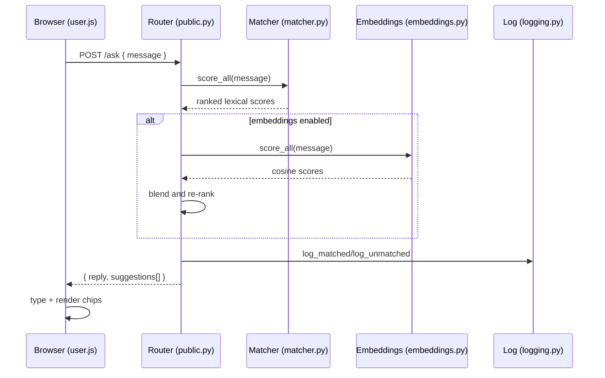
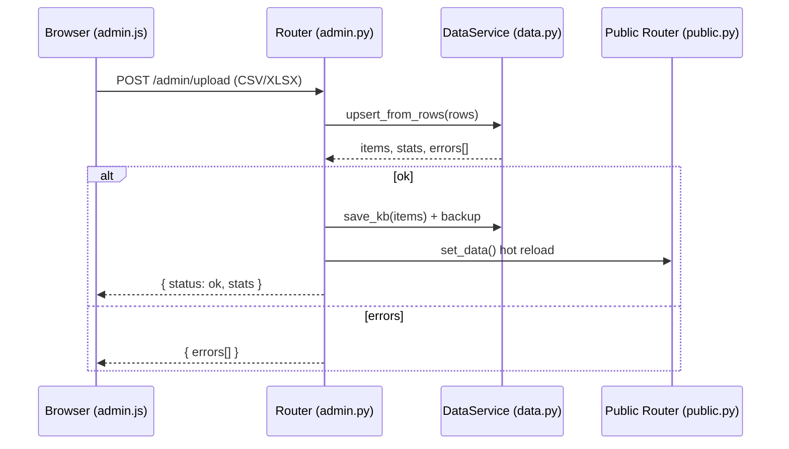

# Developer Guide

A deep dive into the Offline Chatbot codebase: architecture, data flow, files, APIs, and extension points.

## Architecture overview

```mermaid
flowchart LR
  subgraph Client[Browser]
    U[User UI (user.html + user.js)]
    A[Admin UI (admin.html + admin.js)]
  end

  subgraph Server[FastAPI App]
    M[main.py\nCSP/CORS/Static]
    R1[public.py\n/, /ask, /samples]
    R2[admin.py\n/admin, /admin/upload, /admin/unmatched]
    S1[data.py\nload/save, backups, upsert]
    S2[matcher.py\nBM25-ish + fuzzy]
    S3[embeddings.py\noptional local model]
    S4[logging.py\nunmatched/matched logs]
    S5[auth.py\nHTTP Basic]
  end

  U -- ask --> R1
  R1 --> S2
  R1 --> S3
  R1 --> S4
  A -- upload CSV/XLSX --> R2 --> S1 --> R1
  M --- R1
  M --- R2
```

- FastAPI app (`main.py`) initializes middleware, mounts static files, and includes two routers:
  - `app/routers/public.py` – user-facing endpoints (`/`, `/ask`, `/samples`)
  - `app/routers/admin.py` – admin UI, KB upload, unmatched viewer
- Services layer under `app/services/` encapsulates core logic:
  - `data.py` – Load/save KB JSON; ingest CSV/XLSX; backups; validation/dedup
  - `matcher.py` – Lexical scoring (BM25-like) + fuzzy; blend signals
  - `embeddings.py` – Optional local semantic encoder and cosine scoring
  - `logging.py` – Sanitized unmatched logging and match debug logs
  - `auth.py` – HTTP Basic auth for admin
- Models under `app/models/` contain Pydantic schemas for requests/responses and KB items.
- Frontend templates (`app/templates/`) rendered via Jinja2; static assets in `app/static/`.

## Data flow

1. Admin uploads CSV/XLSX → `admin.py` reads rows → `DataService.upsert_from_rows()` validates and normalizes → `DataService.save_kb()` writes `data/data.json` (with backup) → `public.set_data()` hot-reloads matcher and embeddings index.
2. User asks question → `/ask` → `Matcher.score_all()` produces ranked results → optional embeddings blend → thresholds decide reply text and suggestions → unmatched logged when confidence is low.
3. UI renders reply with optional suggestions; clicking a suggestion re-asks the selected question.

### Sequence: Ask flow



### Sequence: Admin upload



## Files and responsibilities

- `main.py`
  - FastAPI app creation, CORS, security headers (CSP, X-Frame-Options, etc.).
  - Static mount at `/static`. Includes routers. `/health` endpoint.
- `app/routers/public.py`
  - `GET /` – serves `user.html`.
  - `POST /ask` – scoring pipeline; returns `{ reply, suggestions }` with relevance filter and fallbacks.
  - `GET /samples` – sample questions for Quick Start chips.
  - `set_data()` – hot-reload after admin updates.
- `app/routers/admin.py`
  - `GET /admin` – serves `admin.html` (Bootstrap UI).
  - `POST /admin/upload` – accepts `.csv` and `.xlsx` (openpyxl) and applies updates.
  - `GET /admin/unmatched` – preview `data/unmatched.csv` in a simple HTML wrapper.
- `app/services/data.py`
  - `load_kb()` – reads `data/data.json`, tolerates legacy timestamps.
  - `save_kb()` – backups then writes normalized JSON with ISO timestamps.
  - `upsert_from_rows()` – validates rows; normalizes IDs; dedups repeated questions when `id` missing; merges keywords/tags.
- `app/services/matcher.py`
  - Tokenization; inverted index; BM25-style scoring; fuzzy tie-breaker (RapidFuzz or difflib fallback).
- `app/services/embeddings.py`
  - Loads local sentence-transformers model and pre-encodes KB questions; cosine similarity blend.
- `app/services/logging.py`
  - `log_unmatched()` – scrubs PII and writes `data/unmatched.csv`.
  - `log_matched()` – optional debug log.
- `app/services/auth.py`
  - Basic auth configurable via `ADMIN_USER`/`ADMIN_PASS` env vars.
- `app/models/schemas.py`
  - `AskRequest`, `AskResponse`, `KBItem`, etc.
- Frontend:
  - `app/templates/user.html` – chat layout.
  - `app/static/js/user.js` – chat logic, typing effect, suggestions.
  - `app/static/css/main.css` – UI styling.
  - `app/templates/admin.html` – admin dashboard.
  - `app/static/js/admin.js` – upload flow.

## APIs

- `POST /ask`
  - Request: `{ "message": string }`
  - Response: `{ "reply": string, "suggestions": string[] }`
- `GET /samples`
  - Response: `{ "samples": string[] }`
- `POST /admin/upload`
  - Multipart form file under `file`; supports `.csv` and `.xlsx`.
  - Response: `{ status: "ok", stats: { added, updated, removed, deduplicated } }` or `{ errors: string[] }`.
- `GET /admin/unmatched`
  - Returns HTML preview of `data/unmatched.csv`.

## Matching logic

- Tokenize question text → compute term weights (~BM25) → sum per KB question.
- Add fuzzy similarity boosts for near matches.
- Optional embeddings cosine blend when local model folder present.
- Thresholds:
  - High (>= 0.78): answer directly; offer other relevant suggestions.
  - Medium (>= 0.6): suggest similar questions; if none relevant, return top answer.
  - Low (< 0.6): suggest if any relevant; otherwise ask to rephrase; always log unmatched.

## Offline considerations

- No network calls at runtime. Serve all assets locally or allow Bootstrap CDN via CSP if needed; you can self-host Bootstrap to tighten CSP to `'self'`.
- Semantic embeddings only load from a local directory.

## Extending

- Add feedback buttons under answers and log feedback to improve ranking.
- Implement search over unmatched to bulk-create new KB entries.
- Swap in a proper BM25 from `rank-bm25` or a vector DB if you later allow dependencies.

## Testing

- `tests/test_matcher.py` basic sanity test. Add more tests for `DataService.upsert_from_rows` and router endpoints if needed.

## Conventions

- Python 3.10+; code formatted with Black/PEP8 style in mind.
- Pydantic models for all IO; timestamps in ISO 8601 with trailing `Z` when serialized.

